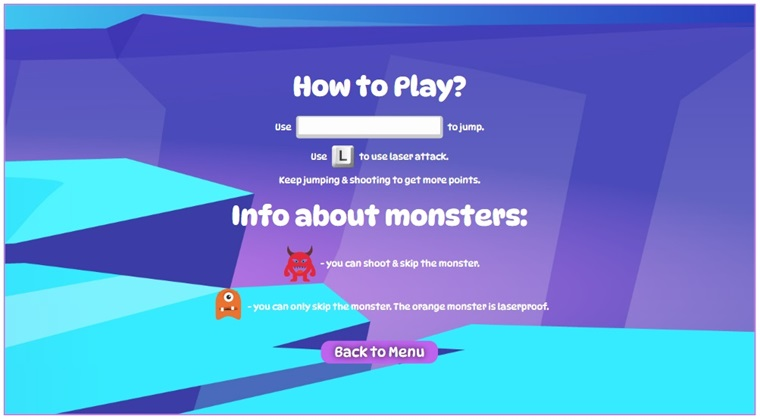
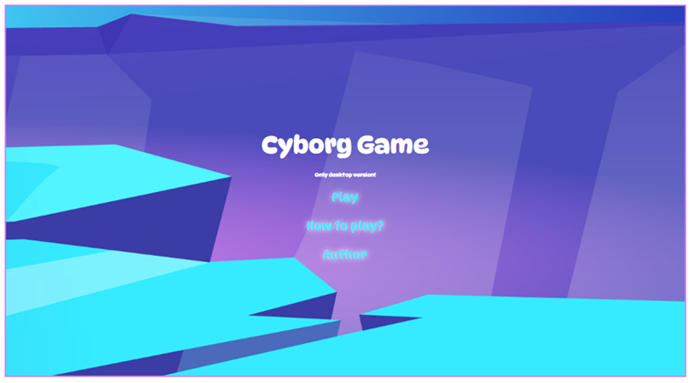
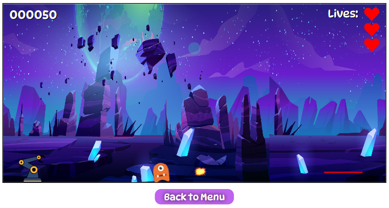
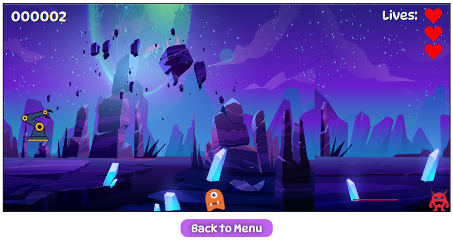
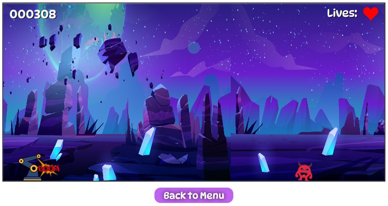
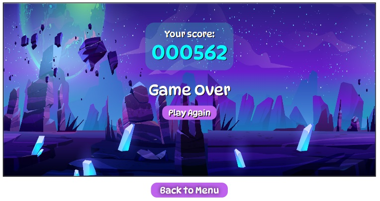

    

## Table of contents

- [General info](#general-info)
- [How to play?](#how-to-play)
- [Technologies](#technologies)
- [Screenshots](#screenshots)
- [Live](#live)
- [Background image info](#background-image-info)

## General info

Cyborg Game written using Vanilla JavaScript. Cyborg 2D jumping game. Keep jumping & shooting to get more points and avoid monster to not to die.

## How to play?

## Technologies

Project was created with:

- HTML5
- SCSS
- JavaScript

## Screenshots

  
  

## Live

Wanna play? Click link below & have fun!

https://goldipl.github.io/Cyborg_Game/

## Background image info

<a href="https://www.freepik.com/vectors/alien-planet">Alien planet vector created by upklyak - www.freepik.com</a>
